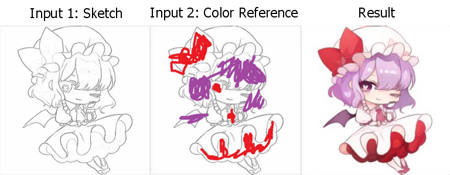

# SketchColorization
*A convolutional neural network that colorizes sketches using roughly made color hints*



## Introduction
The repository contains the code for SketchColorization, a convolutional neural network to color sketches using rough color hints.
It contains the code to use it along with pre-trained weights and also code to train the model yoursef.

## Characteristics
* Small and fast model. ~8M parameters.
* Uses an alternative custom colorspace to achieve increased colorfulness in predictions.


## Prerequisites
- Linux
- Anaconda
- NVIDIA GPU (CUDA >= 11)
- pytorch and fastai

## Installation
Create environmente and install packages
```shell
conda env create -f environment.yml
```

## To colorize

* Download Pretrained Weights from [releases](https://github.com/alcros33/SketchColorizaion/releases/tag/pretrained_weights), and put `colorizer.pkl` into the [models/](models/) folder.
```Shell
python colorize.py sketchimage colorhintimage --savename path/to/save.jpg
```

## To train
### Downloading the dataset 
You can train using any sketch and color pair dataset, but [danbooru2021](https://www.gwern.net/Danbooru2021) was used to train this model. Instructions to download and clean the dataset are included in the file [DownloadAndClean.ipynb](DownloadAndClean.ipynb).

### Generate artificial linearts
To generate linearts from the color images to train the model you can use the notebook [LA/toLA.ipynb](LA/toLA.ipynb) in which there are 4 methods available [sketch_keras](https://github.com/higumax/sketchKeras-pytorch), [sketch_simplification](https://github.com/bobbens/sketch_simplification), [anime2sketch](https://github.com/Mukosame/Anime2Sketch) and XDOG. For the CNN methods, you must download the pretrained weights for each one [releases](https://github.com/alcros33/SketchColorizaion/releases/tag/pretrained_weights).

### Run training
Follow the [Train.ipynb](Train.ipynb) notebook.

## More Results
